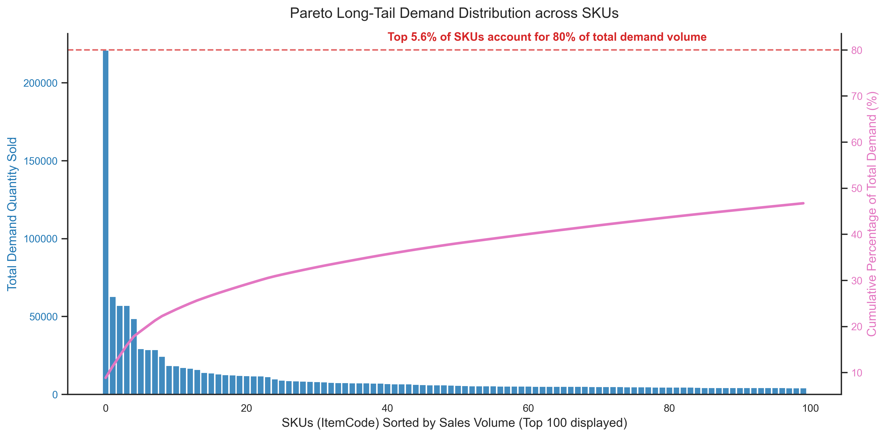
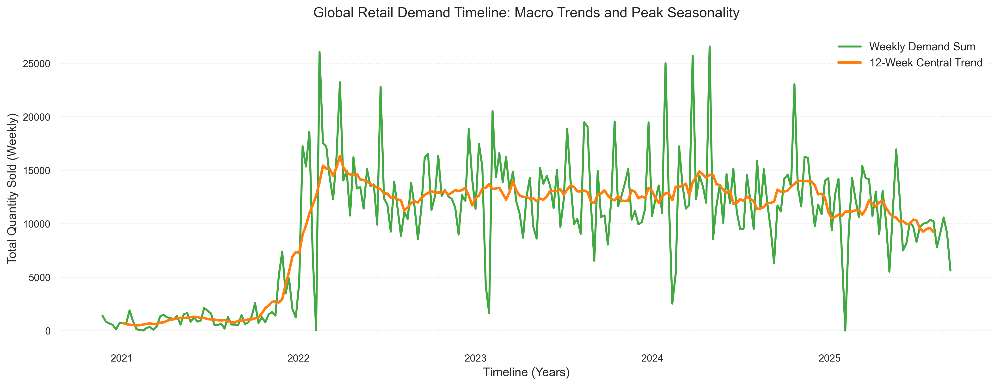
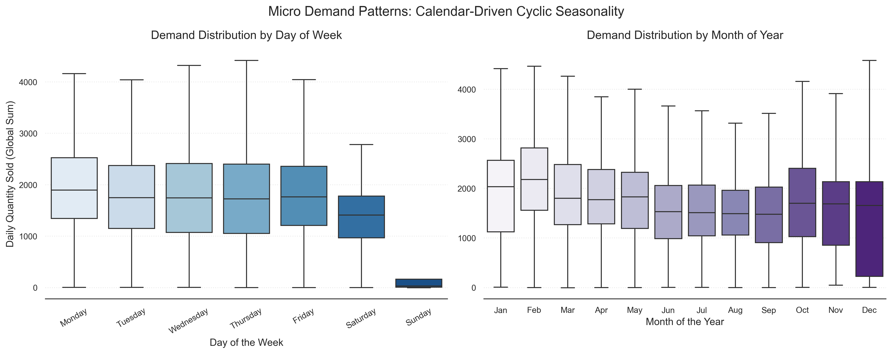

# Báo cáo Phân tích Khám phá Dữ liệu (EDA)

Tài liệu này tổng hợp các phát hiện cốt lõi từ dữ liệu giao dịch bán lẻ lịch sử của cuộc thi HBAAC, cung cấp cơ sở phân tích khoa học cho các bước kỹ thuật đặc trưng và mô hình hóa tiếp theo.

---

## 1. Phân tích Pareto (Phân phối Đuôi dài)
*Tệp hình ảnh: `pareto_sku_distribution.png`*

### Phát hiện chính:
*   **Sự tập trung danh mục (Long-tail)**: Biểu đồ kết hợp cột và đường cong tích lũy màu hồng cho thấy sự sụt giảm khối lượng bán ra theo từng mã hàng là cực kỳ dốc.
*   **Insight Định lượng**: Nhãn màu đỏ trên biểu đồ chỉ ra rõ: **Chỉ Top 5.6% số lượng SKU đã chiếm đến 80% tổng khối lượng bán ra toàn hệ thống**.

### Định hướng mô hình hóa:
> [!IMPORTANT]
> Khoảng **94.4% SKU còn lại** thuộc nhóm "đuôi dài" (long-tail), đóng góp rất ít vào doanh số và có thể chứa nhiều ngày không phát sinh giao dịch (zero-sales). Vì chuẩn đánh giá là **WRMSSE** (đánh trọng số theo doanh thu), các mô hình dự báo của chúng ta ở Giai đoạn 4 phải tập trung tối ưu hóa độ chính xác tuyệt đối cho nhóm **5.6% SKU hạt giống** này.

---

## 2. Xu hướng Vĩ mô & Tính Mùa vụ
*Tệp hình ảnh: `macro_sales_trends.png`*

### Phát hiện chính:
*   **Lịch sử Toàn cục**: Đường màu xanh lục (Weekly Demand Sum) và đường màu cam (12-Week Trend) cho thấy chuỗi thời gian có một sự thay đổi cấu trúc lớn. Giai đoạn 2021 lượng bán rất thấp (có thể do thiếu dữ liệu hoặc gián đoạn chuỗi cung ứng), nhưng bùng nổ đột biến vào cuối 2021/đầu 2022.
*   **Biến động Mùa vụ**: Sau cú bứt phá năm 2022, chuỗi dữ liệu duy trì một dải dao động ổn định (từ 10,000 đến 25,000 đơn vị/tuần) với các đỉnh nhọn xuất hiện lặp lại theo chu kỳ hằng năm.

### Định hướng mô hình hóa:
> [!TIP]
> Khi huấn luyện, ta có thể cần cân nhắc **"cắt bỏ" hoặc giảm trọng số của giai đoạn dữ liệu dị thường đầu năm 2021**, vì nó không phản ánh "bình thường mới" của hành vi tiêu dùng từ năm 2022 trở đi.

---

## 3. Cấu trúc Nhu cầu Vi mô (Chu kỳ Lịch)
*Tệp hình ảnh: `micro_calendar_seasonality.png`*

### Phát hiện chính:
*   **Theo Ngày trong Tuần (Day of Week)**: Biểu đồ hộp bên trái (màu xanh dương) chỉ ra rằng nhu cầu duy trì ở mức cao và khá đồng đều từ Thứ Hai đến Thứ Năm (Median ~1700 - 2000). Nhu cầu giảm nhẹ vào Thứ Bảy và chạm đáy gần bằng 0 vào Chủ Nhật. Điều này cho thấy đây có thể là loại hình bán lẻ B2B hoặc cửa hàng không hoạt động/giảm công suất vào ngày cuối tuần.
*   **Theo Tháng trong Năm (Month of Year)**: Biểu đồ bên phải (màu tím) thể hiện mức bán cao nhất rơi vào giai đoạn Tháng 1 và Tháng 2 (Median trên 2000), sau đó giảm dần đều và tạo thành "vùng trũng" vào các tháng Hè và Thu (Tháng 6 - Tháng 10), trước khi nhích nhẹ lên vào cuối năm. Sự trùng khớp của đỉnh điểm Tháng 1/Tháng 2 rất có thể liên quan đến chu kỳ mua sắm Tết Nguyên Đán.

### Định hướng mô hình hóa:
> [!WARNING]
> 1. Ta bắt buộc phải tạo các đặc trưng (features) **One-Hot Encoding cho DayOfWeek và Month** trong Giai đoạn Mô hình hóa.
> 2. Mô hình cũng phải học được quy luật **"Chủ Nhật không bán hàng"** để tránh dự báo sai lệch (thiết lập đặc trưng `is_sunday` hoặc hậu xử lý đưa kết quả ngày Chủ Nhật về 0).
